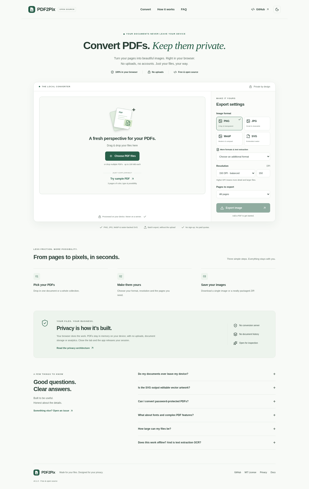

# PDF2Pix

**Convert PDFs. Keep them private.**

A free, MIT-licensed PDF-to-image workspace. Convert multiple PDFs locally with previews, page ranges, DPI controls and ZIP downloads. No account, conversion server, telemetry or document upload.

[Project site](https://lakshminarayanan2003.github.io/pdf-to-image/) · [Source](https://github.com/LakshmiNarayanan2003/pdf-to-image) · [Report an issue](https://github.com/LakshmiNarayanan2003/pdf-to-image/issues)

> Version **0.1.0**. Published on GitHub Pages from `master`. See [verification status](docs/VERIFICATION.md) for observed results (43 unit/component tests and 55 cross-browser tests passing) and the scope of testing.



[Dark theme](docs/images/desktop-dark.png) · [Mobile dark workspace](docs/images/mobile-dark.png)

## What you can do

- Convert one PDF or a batch; preview pages and choose which documents to include.
- Export all pages, the active page, or a custom range such as `1-3,5,8-10`.
- Save one output directly; multiple outputs are automatically packaged in a ZIP.
- Choose 72, 96, 150, 200 or 300 DPI, or custom 36–600 DPI within canvas limits.
- Adjust JPEG/WebP quality, preserve PNG transparency, or use white JPEG backgrounds.
- Unlock supported encrypted PDFs using an in-memory password dialog.
- Extract selectable text as TXT or structured JSON. This is **not OCR**.
- Use keyboard controls, a responsive mobile workspace, light/dark themes, cancellation and recovery.
- Try a bundled, original three-page sample with all normal controls enabled.

## Formats, honestly

| Output   | Behavior                                                                                                |
| -------- | ------------------------------------------------------------------------------------------------------- |
| PNG      | Lossless **raster encoding**, alpha transparency; not lossless preservation of the PDF itself           |
| JPG/JPEG | Raster output, quality control, opaque white background                                                 |
| WebP     | Raster output, quality control; enabled only if the browser encodes WebP                                |
| SVG      | **Embedded PNG inside SVG. Not editable or vector-preserving.** DPI determines detail                   |
| TXT      | Selectable text extraction, one UTF-8 file per page; no OCR                                             |
| JSON     | Page dimensions/rotation and text items with positions; no OCR or layout reconstruction                 |
| AVIF     | Only offered after a real native canvas encoding probe succeeds; unavailable in locally tested Chromium |

TIFF, OCR, DOCX, PPTX and true vector SVG are not implemented. Modern PDF.js does not export its historical SVG renderer. A separate vector interpreter would require additional fidelity, licensing and security work. [Format details](docs/FORMAT_SUPPORT.md).

## Development

Use Node **24.19.0 LTS** (see `.nvmrc`) and npm. The lockfile is committed.

```sh
nvm use
npm ci
npm run dev
```

Vite uses `/pdf-to-image/` in development and production. Follow the development server's printed path. No environment variables or credentials are required for conversion.

```sh
npm run check                    # types, lint, formatting, unit/component tests, build, static/docs checks
npx playwright install --with-deps chromium firefox webkit
npm run test:e2e                  # actual browser conversion, privacy, accessibility and output checks
npm audit --audit-level=moderate
npm run preview                  # serve the production bundle
```

On an environment that provides Chromium but blocks browser downloads:

```sh
PLAYWRIGHT_CHROMIUM_EXECUTABLE_PATH=/usr/bin/chromium npm run test:e2e -- --project=chromium
```

This does not substitute for Firefox/WebKit coverage. For a writable npm cache in restricted cloud environments, set `npm_config_cache=/tmp/pdf2pix-npm-cache`. Never disable TLS or signature verification.

[Testing guide](docs/TESTING.md) · [Contribution guide](CONTRIBUTING.md)

## Sample and fixtures

[public/sample.pdf](public/sample.pdf) is generated and committed. It contains three distinct pages: colored vector/text artwork, an original generated raster with transparent overlapping shapes, and a landscape typography/vector page with rotated text. All artwork is created by this project; no external image assets are used.

```sh
npm run fixtures
```

This deterministic script also creates text, raster, vector, rotated, cropped, transparent, mixed-size, corrupt, empty, renamed and sentinel fixtures. The encrypted fixture is committed separately; optional regeneration uses `scripts/generate-encrypted-fixture.py` with `pypdf==6.19.0`. Its public test password is `local-test-password`, not a secret.

## Privacy model

1. A file picker or drop reads local `File` bytes into memory.
2. PDF.js receives a `Uint8Array`, never a user-supplied URL. A bundled worker interprets the PDF.
3. Canvases render selected pages sequentially. Native encoders or local text extraction produce Blobs; JSZip packages batches in memory.
4. Object URLs deliver previews and downloads. Document workers, render tasks, canvases and URLs are released on completion, cancellation, replacement, removal or navigation as applicable.

There is no backend, analytics, account system, runtime CDN, application service worker or browser storage of documents/settings. Runtime JS, CSS, icons, workers, fonts, CMaps and WASM are served from the same deployed static site. Rendering assets may download on demand. The sample button intentionally fetches public `sample.pdf` from that site.

The CSP permits only same-origin connections and scripts, local blob/data images and fonts, and WASM compilation. Forms and embedded objects are blocked. Uploaded filenames/text never become HTML or network parameters. Exports use sanitized filenames; SVG is constructed only from numeric dimensions and a locally encoded PNG.

Static hosting still sees normal asset requests and connection metadata. A browser extension, compromised browser, operating-system swap, downloads folder, hostile PDF exploit or compromised published build is outside this application's guarantee. Browser memory cannot be securely wiped by JavaScript. See [PRIVACY.md](PRIVACY.md) and [SECURITY.md](SECURITY.md).

## Architecture

- `src/hooks/useConverter.ts`: session state, load/export orchestration and cleanup.
- `src/lib/pdf.ts`: byte-based loading, bundled worker/assets and passwords.
- `src/lib/render.ts`: cancellable raster rendering, native codecs and SVG container.
- `src/lib/export.ts`: selection planning, sequential encoding, extraction, ZIP and naming.
- `src/lib/utils.ts`: validation, limits and pure utilities.
- `src/components/`: preview, settings, password dialog and public product content.
- `scripts/`: deterministic fixtures, asset/security checks, licenses and screenshots.

PDF.js and JSZip load on demand. Preview/thumbnail resolution is bounded, only eight thumbnails are mounted per navigation group, and thumbnails render when near the viewport. [Architecture and limits](docs/ARCHITECTURE.md).

## GitHub Pages

The canonical URL is `https://lakshminarayanan2003.github.io/pdf-to-image/`. Select **GitHub Actions** under repository **Settings → Pages → Build and deployment**, then push to `master` or dispatch the deployment workflow on `master`.

CI performs clean installation, types, lint, format, tests, production build, static/privacy checks, audit and browser tests. The deployment workflow reuses those checks and deploys only their verified artifact. Pull requests do not deploy. Permissions are scoped to the deployment job.

The request also mentioned `/pdf2pix/`. That path is supported as an explicit build override, but the actual repository's Pages path is `/pdf-to-image/`:

```sh
VITE_BASE_PATH=/pdf2pix/ npm run build
VITE_BASE_PATH=/pdf2pix/ npm run test:e2e -- --project=chromium --grep 'sample: all pages'
```

Changing Vite's base does not change the GitHub repository's Pages URL. Canonical/SEO URLs remain the preferred actual repository URL. [Deployment guide](docs/DEPLOYMENT.md).

## Limits and troubleshooting

Safety caps: **100 MB per PDF, 200 MB total input, 20 documents, 500 pages per export, 16 million output pixels per page, 8192 pixels per side and 128 MB of encoded output per batch**. These are resource safeguards, not paid quotas. Actual peak memory includes PDF decoding and ZIP copies and may exceed encoded output size. Close other tabs, lower DPI or split files when resources are insufficient.

- **Empty text output:** scanned PDF pages may have no selectable text. No OCR is performed.
- **Missing font/details:** embedded/standard fonts are supported; missing fonts, unusual color spaces, interactive annotations or XFA can render differently. Inspect important results.
- **Unsupported WebP/AVIF:** use PNG/JPEG. The app never silently returns a PNG with the wrong extension.
- **Blank/corrupt file:** check it in another reader. Mixed batches retain successfully opened PDFs and report invalid inputs.
- **Sample/worker 404:** confirm the Vite base, deploy the entire `dist` directory and avoid opening `index.html` directly from disk.
- **Memory/canvas error:** lower DPI or export fewer pages. Extreme PDFs can still exhaust browser resources despite safety limits.
- **Offline:** conversion is local, but first use of an auxiliary asset may need a network request. Fully offline use is not promised.

## Browser support and accessibility

Target current desktop/mobile Chromium, Firefox and Safari with ES2022, workers, canvas, Blob downloads, native dialogs and modern PDF.js requirements. The locally observed Chromium version and cross-browser limitations are recorded in [verification](docs/VERIFICATION.md). Native encoders differ by browser. Automated axe and keyboard checks support, but do not establish, complete WCAG 2.2 AA conformance. Manual assistive-technology testing remains valuable.

## Open source

MIT © 2026 Lakshmi Narayanan Sridharan. [License](LICENSE) · [Third-party notices](THIRD_PARTY_NOTICES.md) · [Changelog](CHANGELOG.md) · [Roadmap](ROADMAP.md) · [Code of conduct](CODE_OF_CONDUCT.md).

Contributions should preserve local processing, honest fidelity labels, accessibility and meaningful output tests. There are no invented performance metrics or security certifications.
