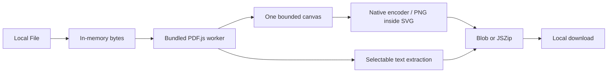

# Architecture

React + strict TypeScript with Vite and Tailwind's local CSS pipeline. Native semantic controls and the platform `dialog` provide accessible primitives without a large UI framework. Lucide supplies bundled icons; system font stacks avoid font downloads. No backend is present.

`useConverter` coordinates loading/export and owns the active AbortController. The loading task owns the PDF.js worker; each document is explicitly destroyed on removal, replacement and clear. The currently selected file/page drives a bounded preview. At most eight low-resolution thumbnails are mounted, with IntersectionObserver-driven generation and URL revocation on eviction. Full-resolution export pages render sequentially, independently from previews. Render tasks subscribe to cancellation and page resources are cleaned after rendering.

Export planning computes unique sanitized stems and page ranges before processing. Current-page export targets the active PDF; All/Custom target checked PDFs. Ranges must be valid for each target. Single outputs are downloadable Blobs; multiple outputs use JSZip STORE to avoid wasted compression CPU on already-compressed images. Encoded output is capped; a ZIP still requires memory proportional to the accepted batch. There is no disk streaming in this version.

| Limit         | Value                                   |
| ------------- | --------------------------------------- |
| PDF input     | 100 MB each, 200 MB total, 20 documents |
| Export pages  | 500 per operation                       |
| Custom DPI    | 36–600                                  |
| Canvas        | 16 million pixels, 8192 per side        |
| Encoded batch | 128 MB                                  |

These are explicit rejections rather than silent resolution reduction. PDF decompression, embedded images and JSZip copies can exceed these amounts; they are not a universal memory guarantee. Preview size is bounded independently of devicePixelRatio. Encoding checks actual Blob MIME type and rejects unsupported codecs. SVG is entirely generated from trusted numeric dimensions and PNG bytes; PDF strings cannot create SVG elements or attributes.

PDF.js API integration follows its current distribution/types: `GlobalWorkerOptions.workerSrc` receives Vite's `?url` bundled worker, `getDocument` receives bytes and same-origin auxiliary paths, and lifecycle destruction uses `pdf.loadingTask.destroy()`. No historical SVG API is used. Missing/unsupported interactive features are documented rather than emulated.
